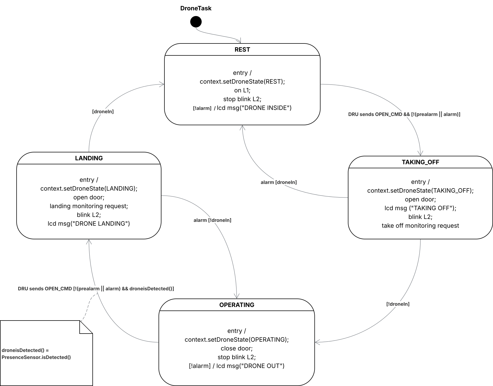
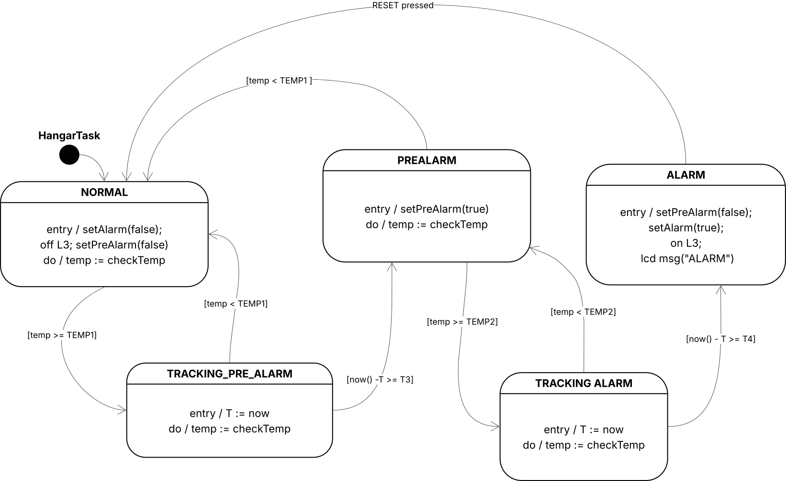
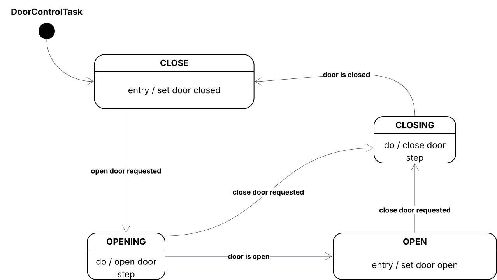
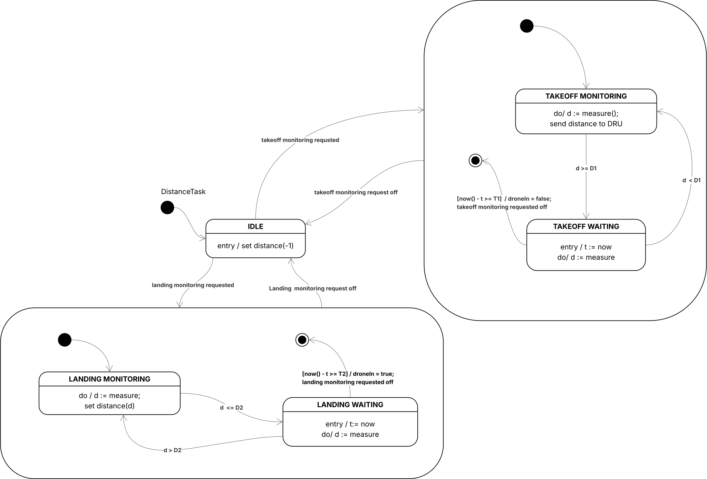
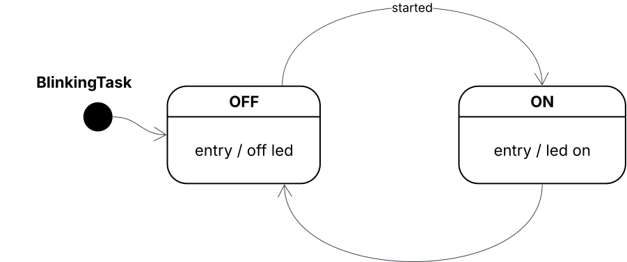

# Report Assignment #02 – *Smart Drone Hangar*
This document describes the design and implementation of the Smart Drone Hangar system developed for Assignment #02 of the Internet of Things course at the University of Bologna.

## System schema


## Video demo
You can find the video demo [here](./video.md).

### Authors

**Filippo Greppi**
- Email: <filippo.greppi2@studio.unibo.it>
- Student ID: 0001114837
 
**Marcello Spagnoli**  
- Email: <marcello.spagnoli2@studio.unibo.it>  
- Student ID: 0001117244  

---

## Table of Contents

1. [Introduction](#1-introduction)
2. [System Architecture](#2-system-architecture)
3. [Hardware Components](#3-hardware-components)
4. [Software Architecture](#4-software-architecture)
5. [Task-Based Implementation](#5-task-based-implementation)
6. [Finite State Machines](#6-finite-state-machines)
7. [Communication Protocol](#7-communication-protocol)
8. [Testing](#8-testing)
9. [Appendix: File Structure](#appendix-file-structure)

---

## 1. Introduction

The **Smart Drone Hangar** is an embedded system designed to manage autonomous drone operations, including take-off, landing, and temperature monitoring. The system consists of two main subsystems:

- **Drone Hangar (Arduino)**: Controls hangar door, monitors temperature, and manages drone presence detection
- **Drone Remote Unit (PC)**: Java-based GUI application for remote drone control and monitoring

The system implements a task-based cooperative scheduler with synchronous Finite State Machines (FSMs) for robust and predictable behavior.

---

## 2. System Architecture

### 2.1 Overview

The system follows a **distributed architecture** with two communicating subsystems:

```
┌─────────────────────────┐          Serial          ┌──────────────────────────┐
│   Drone Hangar          │ ◄──────  (115200)  ────► │  Drone Remote Unit       │
│   (Arduino/C++)         │          JSON            │  (PC/Java)               │
└─────────────────────────┘                          └──────────────────────────┘
         │                                                     │
         ├─ PIR Sensor (Presence Detection)                    ├─ GUI Controls
         ├─ Sonar (Distance Measurement)                       ├─ State Visualization
         ├─ Servo Motor (Door Control)                         ├─ Command Sending
         ├─ Temperature Sensor (TMP36)                         └─ Distance Display
         ├─ LCD Display (I2C)
         ├─ LEDs (L1, L2, L3)
         └─ Reset Button
```

### 2.2 Communication Flow

The two subsystems communicate via **serial line** using JSON messages:

- **Commands**: PC → Arduino (e.g., `{"cmd": "OPEN"}`)
- **State Updates**: Arduino → PC (periodic, every 500ms)
  - Drone state (rest, taking_off, operating, landing)
  - Hangar state (normal, pre_alarm, alarm)
  - Distance readings
  - Temperature readings

---

## 3. Hardware Components

### 3.1 Pin Configuration

| Component | Type | Pin | Description |
|-----------|------|-----|-------------|
| **L1** | Green LED | 3 | Drone presence indicator |
| **L2** | Green LED | 5 | Operation indicator (blinking) |
| **L3** | Red LED | 7 | Alarm indicator |
| **RESET** | Button | 8 | System reset (alarm clear) |
| **DPD** | PIR Sensor | 2 | Drone Presence Detector |
| **HD** | Servo Motor | 11 | Hangar Door controller |
| **DDD Echo** | Sonar | 12 | Distance measurement (echo) |
| **DDD Trigger** | Sonar | 13 | Distance measurement (trigger) |
| **TEMP** | TMP36 | A0 | Temperature sensor (analog) |
| **LCD** | I2C Display | I2C (0x27) | 20x4 character display |

### 3.2 Hardware Specifications

- **LCD**: 20 columns × 4 rows, I2C address 0x27
- **Servo Motor**: 0°-180° range, door fully open at 180°
- **Temperature Sensor**: TMP36 analog sensor
- **Sonar**: HC-SR04 ultrasonic sensor (range: 2cm - 400cm)
- **PIR Sensor**: Passive infrared motion detector

---

## 4. Software Architecture

### 4.1 Arduino Platform

The Arduino subsystem is built using **PlatformIO** and implements:

- **Kernel Layer**:
  - `Scheduler`: Cooperative task scheduler (base period: 50ms)
  - `MsgService`: Serial communication handler with JSON parsing
  - `Logger`: Debug logging facility
  - `Task`: Base class for all tasks

- **Model Layer**:
  - `Context`: Shared state container for inter-task communication
  - `HWPlatform`: Hardware abstraction layer

- **Device Layer**:
  - Hardware drivers for all sensors and actuators
  - Abstraction interfaces (Button, Light, ProximitySensor, etc.)

- **Task Layer**:
  - 7 concurrent tasks with different periods
  - FSM-based logic for state management

### 4.2 PC Platform (Java)

The Java subsystem follows **MVC pattern**:

- **Model** (`DroneRemoteUnitModelImpl`):
  - Manages connection state
  - Parses incoming JSON messages
  - Maintains drone/hangar state

- **View** (GUI):
  - Control buttons (Take-off, Land)
  - State displays (drone state, hangar state)
  - Distance visualization

- **Controller** (`DroneRemoteUnitControllerImpl`):
  - Handles user interactions
  - Sends commands to Arduino
  - Updates view based on model changes

- **Communication** (`JSSCCommChannel`):
  - JSSC library for serial communication
  - JSON serialization/deserialization
  - Background service for message polling

---

## 5. Task-Based Implementation

### 5.1 Task Overview

The system implements **7 concurrent tasks** with cooperative scheduling:

| Task | Period (ms) | Purpose |
|------|-------------|---------|
| **DroneTask** | 50 | Main FSM controlling drone lifecycle |
| **HangarTask** | 200 | Temperature monitoring and alarm management |
| **BlinkingTask** | 500 | L2 LED blinking during operations |
| **DoorControlTask** | 50 | Smooth servo motor control |
| **DistanceTask** | 50 | Sonar monitoring with debouncing |
| **LCDTask** | 100 | LCD display updates |
| **MSGTask** | 50 | Serial communication handling |

They interact by using the Context, which holds all the shared variables

### 5.2 Scheduler Details

- **Base Period**: 50ms
- **Scheduling Policy**: Cooperative (non-preemptive)
- **Task Execution**: Each task's `tick()` method called at its period
- **Memory Management**: Static allocation for predictability
- **WCET Analysis**: Built-in worst-case execution time monitoring

---

## 6. Finite State Machines

### 6.1 DroneTask FSM




### 6.2 HangarTask FSM




### 6.3 DoorControlTask FSM



### 6.4 DistanceTask FSM



### 6.5 BlinkingTask FSM



---

## 7. Communication Protocol

### 7.1 Message Format

All messages use **JSON format** for clarity and extensibility.

### 7.2 Commands (PC → Arduino)

**Open Door Command**:
```json
{
  "cmd": "OPEN"
}
```

### 7.3 State Updates (Arduino → PC)

**Periodic Status Message** (every 500ms):
```json
{
  "drone": "rest",           // "rest" | "taking_off" | "operating" | "landing"
  "hangar": "normal",        // "normal" | "pre_alarm" | "alarm"
  "distance": 15.4,          // Current distance in cm
  "temperature": 25.3,       // Current temperature in °C
  "alive": true              // Heartbeat indicator
}
```

### 7.4 Command Handling

- **Queue-based**: Commands stored in Context queue
- **TTL (Time-To-Live)**: Commands expire after 5000ms
- **Priority**: FIFO (First-In-First-Out)
- **Validation**: Commands ignored during alarm state

---

## 8. Testing

### 8.1 Hardware Testing Mode

The system includes a dedicated `TestHWTask` for component validation:

- **Activation**: Define `__TESTING_HW__` in `main.cpp`
- **Tests**:
  - LED functionality (L1, L2, L3)
  - Button input (RESET)
  - LCD display
  - Servo motor range
  - PIR sensor detection
  - Sonar distance measurement
  - Temperature sensor readings


### 8.2 Memory Monitoring

Debug mode tracks free RAM:

- **Activation**: Define `_MEMORY_DEBUG_`
- **Reporting**: Every 5 seconds
- **Purpose**: Detect memory leaks

**End of Report**
